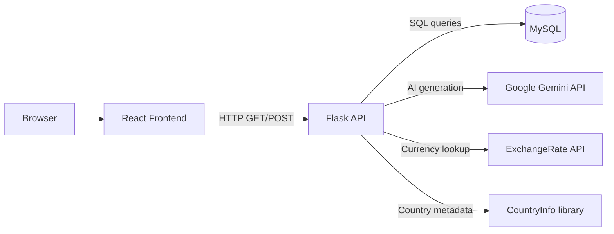
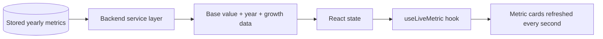
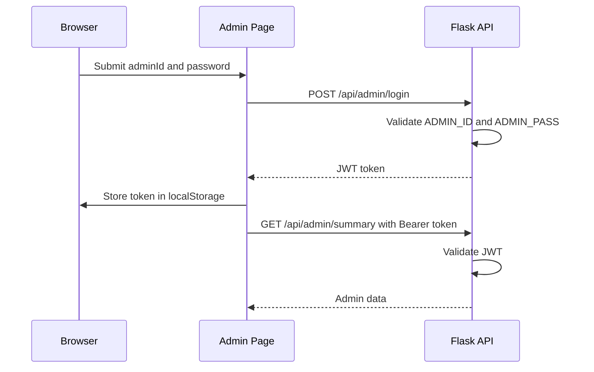

Live Deployment: [https://economic-intelligence.vercel.app](https://economic-intelligence.vercel.app)

# Economy Intelligence

Economy Intelligence is a full-stack web application for viewing world, continent, and country economic metrics, running authenticated admin database operations, and generating AI-based country analysis.

## Overview

- Frontend: React + Vite + Tailwind CSS
- Backend: Flask
- Database: MySQL
- AI integration: Google Gemini
- Authentication: JWT for admin routes

## System Architecture



## Application Flow

```mermaid
flowchart TD
    Home[Home Page] --> World[World Page]
    Home --> Continents[Continents Page]
    Home --> Countries[Countries Page]
    Home --> GeminiPage[Gemini Page]
    Home --> Admin[Admin Page]

    World --> WorldApi["GET /api/world"]
    Continents --> ContinentsApi["GET /api/continents"]
    Continents --> ContinentDetailApi["GET /api/continents/:code"]
    Countries --> CountriesApi["GET /api/countries"]
    Countries --> CountryDetailApi["GET /api/countries/:id"]
    Countries --> CountryAssistantApi["POST /api/assistant/chat"]
    GeminiPage --> GeminiIntelApi["GET /api/gemini/intelligence"]
    GeminiPage --> GeminiConsultApi["POST /api/gemini/consultant"]
    Admin --> AdminLoginApi["POST /api/admin/login"]
    Admin --> AdminReadApi["GET /api/admin/summary"]
    Admin --> AdminTablesApi["GET /api/admin/tables"]
    Admin --> AdminTableDataApi["GET /api/admin/table-data"]
    Admin --> AdminQueryApi["POST /api/admin/query"]
```



## Runtime Data Flow



## Admin Authentication Flow



## Frontend Routes

| Route | Page | Purpose | Backend usage |
| --- | --- | --- | --- |
| `/` | Home | Landing page with world snapshot and continent preview | `/api/world`, `/api/continents` |
| `/world` | World | Global GDP, population, growth, and trade view | `/api/world` |
| `/continents` | Continents | Regional comparison and selected continent detail | `/api/continents`, `/api/continents/:code` |
| `/countries` | Countries | Country search, live metrics, trade, and AI analyst | `/api/countries`, `/api/countries/:id`, `/api/assistant/chat` |
| `/gemini` | Gemini | Country history generation, charts, and consultant chat | `/api/gemini/intelligence`, `/api/gemini/consultant` |
| `/admin` | Admin | Login, table preview, summary, and query execution | `/api/admin/*` |

## Backend Modules

| File | Responsibility |
| --- | --- |
| `backend/app.py` | Flask application setup, CORS configuration, route registration, and JSON error handling |
| `backend/config.py` | Environment variable loading and application configuration |
| `backend/db.py` | MySQL connections, query helpers, and safe identifier validation |
| `backend/dashboard_service.py` | World and continent overview calculations |
| `backend/country_service.py` | Country list, country detail, trade, population, GDP share, and exchange-rate lookup |
| `backend/ai_service.py` | Gemini intelligence generation and country-question responses |
| `backend/admin_service.py` | Admin summary, table listing, table preview, and SQL execution |
| `backend/auth.py` | JWT creation and admin route protection |
| `backend/live_math.py` | Live GDP and population calculations from stored baselines |

## Frontend Modules

| File | Responsibility |
| --- | --- |
| `frontend/src/App.jsx` | Route map |
| `frontend/src/api.js` | Fetch wrapper, response handling, cache storage, and cache invalidation |
| `frontend/src/hooks/useLiveMetric.js` | Recomputes live numeric values every second |
| `frontend/src/components/Layout.jsx` | Global navigation and page shell |
| `frontend/src/pages/HomePage.jsx` | Landing dashboard |
| `frontend/src/pages/WorldPage.jsx` | World metrics page |
| `frontend/src/pages/ContinentsPage.jsx` | Continent list and detail page |
| `frontend/src/pages/CountriesPage.jsx` | Country explorer and AI analyst page |
| `frontend/src/pages/GeminiPage.jsx` | Gemini intelligence page |
| `frontend/src/pages/AdminPage.jsx` | Admin login and admin tools page |

## Live Metric Logic

The backend returns stored baseline values and annual rates. The frontend recalculates live values every second.

### Nominal GDP

```text
nominal_growth = real_growth + inflation
live_gdp = base_value * (1 + nominal_growth * elapsed_year_fraction)
```

### Population

```text
live_population = base_population * (1 + growth_rate * elapsed_year_fraction)
```

These calculations are implemented in `backend/live_math.py` and mirrored in the frontend through `frontend/src/hooks/useLiveMetric.js` and `frontend/src/utils/live.js`.

## Client-Side Caching

- `frontend/src/api.js` caches GET responses in memory and `sessionStorage`
- default cache TTL is 5 minutes
- cache keys are separated for public and authenticated requests
- admin POST operations invalidate related cached admin data

## Project Structure

```text
.
|-- backend/
|   |-- __init__.py
|   |-- admin_service.py
|   |-- ai_service.py
|   |-- app.py
|   |-- auth.py
|   |-- config.py
|   |-- country_service.py
|   |-- currency.py
|   |-- dashboard_service.py
|   |-- data_helpers.py
|   |-- db.py
|   |-- live_math.py
|   `-- requirements.txt
|-- frontend/
|   |-- index.html
|   |-- package.json
|   |-- postcss.config.js
|   |-- tailwind.config.js
|   |-- vite.config.js
|   `-- src/
|       |-- api.js
|       |-- App.jsx
|       |-- index.css
|       |-- main.jsx
|       |-- components/
|       |-- hooks/
|       |-- pages/
|       `-- utils/
|-- .env.example
|-- DEPLOYMENT.md
|-- LICENSE
|-- PROJECT_REFERENCE.md
`-- README.md
```

## Environment Configuration

The backend loads variables from the root `.env` file through `python-dotenv`.
The frontend loads variables from `frontend/.env`.

### Backend `.env`

| Variable | Purpose |
| --- | --- |
| `DB_HOST` | MySQL host |
| `DB_PORT` | MySQL port |
| `DB_USER` | MySQL username |
| `DB_PASSWORD` | MySQL password |
| `DB_NAME` | MySQL database name |
| `DB_SSL_DISABLED` | Enables or disables MySQL SSL |
| `GEMINI_API_KEY` | Gemini API key |
| `GEMINI_MODEL` | Gemini model name |
| `FLASK_HOST` | Flask host binding |
| `FLASK_PORT` | Local Flask port |
| `PORT` | Host-provided port for deployment environments |
| `FLASK_DEBUG` | Flask debug mode |
| `FRONTEND_ORIGIN` | Allowed frontend origin for CORS |
| `ADMIN_ID` | Admin login ID |
| `ADMIN_PASS` | Admin login password |
| `JWT_SECRET` | JWT signing secret |
| `JWT_EXPIRES_HOURS` | JWT expiration window |

### Frontend `frontend/.env`

| Variable | Purpose |
| --- | --- |
| `VITE_API_BASE_URL` | Backend API base URL, for example `http://localhost:5000/api` |

## Local Setup

### 1. Create environment files

Root `.env`:

```env
DB_HOST=localhost
DB_PORT=3306
DB_USER=root
DB_PASSWORD=your_mysql_password
DB_NAME=economy_intelligence
DB_SSL_DISABLED=false

GEMINI_API_KEY=your_gemini_key
GEMINI_MODEL=gemini-2.5-flash

FLASK_HOST=0.0.0.0
FLASK_PORT=5000
FLASK_DEBUG=true
FRONTEND_ORIGIN=http://localhost:5173

ADMIN_ID=admin
ADMIN_PASS=admin123
JWT_SECRET=change-this-secret
JWT_EXPIRES_HOURS=12
```

Frontend `frontend/.env`:

```env
VITE_API_BASE_URL=http://localhost:5000/api
```

### 2. Install backend dependencies

```bash
pip install -r backend/requirements.txt
```

### 3. Install frontend dependencies

```bash
cd frontend
npm install
```

## Run Locally

### Backend

From the repository root:

```bash
python -m backend.app
```

Default backend URL:

```text
http://localhost:5000
```

### Frontend

From `frontend/`:

```bash
npm run dev
```

Default frontend URL:

```text
http://localhost:5173
```

## API Reference

### Public routes

| Method | Path | Purpose |
| --- | --- | --- |
| `GET` | `/api/health` | Health check |
| `GET` | `/api/world` | World overview and trade summary |
| `GET` | `/api/continents` | Continent list and live metrics |
| `GET` | `/api/continents/:continent_code` | Selected continent detail and top countries |
| `GET` | `/api/countries` | Country list |
| `GET` | `/api/countries/:country_id` | Selected country detail |
| `POST` | `/api/assistant/chat` | AI answer for selected stored country data |
| `GET` | `/api/gemini/intelligence?country=Japan` | Generated country history and summary |
| `POST` | `/api/gemini/consultant` | Gemini country consultant response |

### Admin routes

| Method | Path | Purpose |
| --- | --- | --- |
| `POST` | `/api/admin/login` | Returns JWT token |
| `GET` | `/api/admin/summary` | Returns counts and latest table names |
| `GET` | `/api/admin/tables` | Returns available table names |
| `GET` | `/api/admin/table-data?table=...` | Returns up to 100 rows from a table |
| `POST` | `/api/admin/query` | Executes SQL query and returns result |

## Deployment

Deployment steps are documented in [DEPLOYMENT.md](DEPLOYMENT.md).
